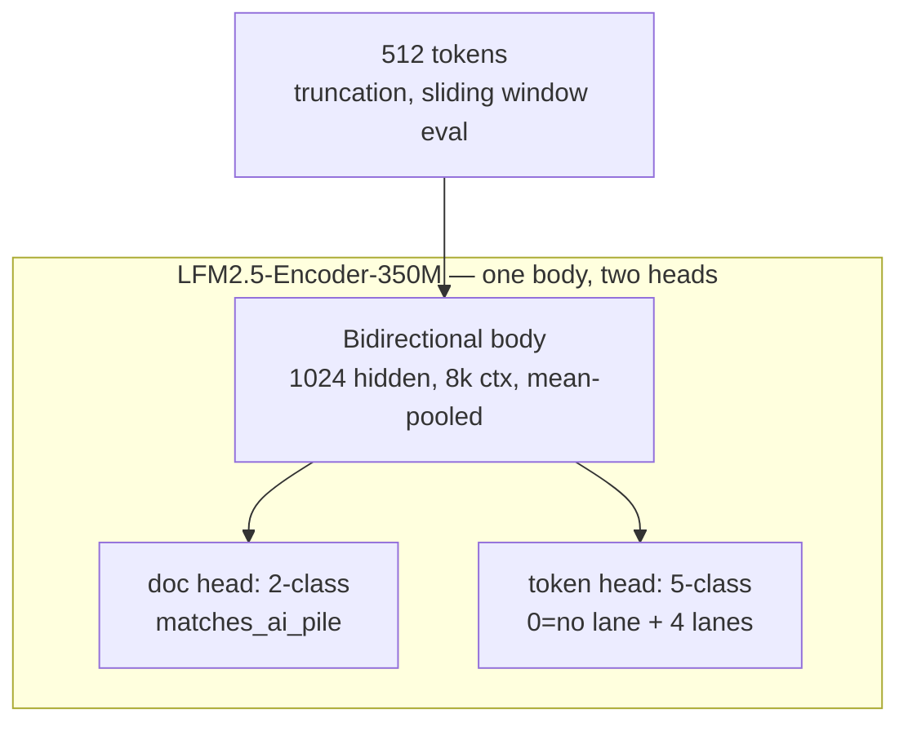

# Is This AI Slop?

**ITAIS** — a local, checkable slop detector. Paste text → get *why* (quoted spans + pattern names), not a `% AI` score.

`slopdet` on PyPI, `itais` on CLI, `isthisaislop` on GitHub. Runs on-device (ONNX `~230MB` INT8, CPU).

   [Dataset: vstalingrady/itais](https://huggingface.co/datasets/vstalingrady/itais)

---

### What it is / isn't

* **Is:** two independent lanes — (1) deterministic why-slop / why-human hits, (2) `matches_ai_pile` resemblance calibrated per register at `1% FPR`. Every hit carries a **verbatim quote**.
* **Isn't:** `87% AI`, `written by ChatGPT`, authorship. `slopdet.report.FORBIDDEN_SUBSTRINGS` blocks it; docs call it `matches_ai_pile` with a named human reference.

> *User hears “more than 95% of humans” as “95% AI” — we keep the `human_percentile` wording but never emit a percentage-of-slop.*

---

### How it works

```mermaid
flowchart LR
    T[Selected text] --> S[split_sentences]
    S --> O[Ontology regex\n~40 patterns × 4 lanes]
    S --> C[Construction stats\nburst / even / recap / gloss]
    O --> H[pack_style → id + quote + fix]
    C --> H
    O --> F[featurize → CPU logistic\nor LFM2 encoder]
    F --> P[matches_ai_pile\nper-register 1% FPR]
    H --> E[explain() → why_slop / why_human / lean]
    E --> R[render_hits\n+ resemblance]
```

**Lanes:**

| lane | means | example ids |
|---|---|---|
| `style` | word/sentence tics | `glue` (delve/leverage), `puffery`, `emdash`, `opener`, `weasel` |
| `rhetorical` | discourse framing | `gloss` (explains after making point), `frames` |
| `construction` | shape of the piece | `even` (flat rhythm), `recap` (tidy close), `burst`/`contrast` (human) |
| `storyscope` | fiction tells | `moral`, `realize`, `agency` |

**`lean` per sentence/doc:** `slop` / `human` / `mixed` / `unclear` — evidence balance, not a verdict.



*Why the encoder?* Token labels need the whole passage bidirectionally. Causal decoder (`1.2B`) sees only left context; INT8 `1.2B` is `~700MB` on phone vs `~230MB` for `230M` (`artifacts/MANIFEST.json` measured `371ms/512tok` on 4 vCPU).

---

### Quickstart

```bash
# from source (uv)
uv sync
uv run itais "Here's the thing, we leverage robust pipelines to unlock synergies."
uv run itais --json "Thursday mornings at the clinic were empty. I counted 41 chairs." | jq

# pip
pip install isthisaislop  # import stays `slopdet`
itais --help
```

**JSON output (truncated):**

```json
{
  "lean": "slop",
  "why_slop": [{"id": "glue", "quote": "leverage", "say": "Stock verb. Name the action.", "lane": "style"}],
  "why_human": [],
  "resemblance": {"label": "matches_ai_pile", "human_percentile": 92, "text": "Resembles the AI pile more than 92% of human reference texts."},
  "sentences": [{"text": "...", "lean": "slop", "why_slop": [...]}]
}
```

**Python:**

```python
from slopdet.explain import explain
print(explain("In today's digital age, we leverage synergies. Thursday at 3pm I met Maya.", sentences=True))
```

**Browser extension:** `extension/` → Load unpacked in `chrome://extensions` → Select text → right-click → ITAIS.

---

### Data — v2 (current): 222k docs, provenance-labeled

`data/v2/v2_train.parquet.labeled.parquet` (287MB, on HF `vstalingrady/itais/v2_train_labeled.parquet`):

| slice | docs | label |
|---|---|---|
| writingprompts human fiction | 61,954 | 0 |
| coai | 38,784 | 8.8k / 30k |
| gutenberg / wiki_intro / blogs human | 36,691 | 0 |
| m4_* (5 domains) | 38,705 | 1 |
| hc3 families (human + `_gpt`) | 13,286 | paired |
| beemo + raid pairs | 6,731 | paired |
| **contrastive generations** `rewrite_pair` + `respond_pair` | **12,803** | 1 |

Labels are provenance-based (a row is AI iff a machine was watched writing it or its
public corpus ships it as AI) — no model-judged ground truth. Every generated story
carries a `split_hint` pair-key (`para:`/`premise:`/`fictpair:`) linking it to its human
source so contrastive pairs never straddle train/eval. Generators for our pairs:
gemma-4-26b, laguna-s-2.1, ox-alpha-free (recorded per row in `generator`).

Holdouts on HF: `v2_holdout_labeled.parquet`, `v2_holdout_paraphrase_labeled.parquet`,
`v2_holdout_mixed.parquet`, `v2_holdout_unseen_model_labeled.parquet` (generator-disjoint).

Rebuild pipeline: oracle generation (`scripts/generate_ai_stories.py`, opencode-go /
ox-alpha-free) → `scripts/merge_all_gen.py` → contamination audit
(`scripts/run_contamination_audit.py`, stratified blind-judge over all 27 registers).

---

### Data — v1 (legacy): 786k docs

`data/training/train_all.parquet` (`1.46GB`, gitignored, on HF `vstalingrady/itais`):

| register | docs | label | source |
|---|---|---|---|
| `pile` (artem9k) | 564,376 | 364k AI / 200k human | real web (news/blogs/essays) — mixed, the honest slice |
| `writingprompts` | 100,000 | human | modern human fiction — breaks fiction confound |
| `coai` | 62,460 | 31k / 31k | arXiv vs LLM paraphrases (academic) |
| `storyscope` | 36,915 | AI | 5-LLM fiction (GPT/DeepSeek/Kimi/Gemini/Claude) |
| `gutenberg` | 15,104 | human | PG≥50000 public-domain fiction |
| `blogs` | 7,807 | human | Schler blogs (HTML extracted) |
| `scp` | 50 | human | CC-BY-SA |

*Excerpt `pile` AI:* “The moon's orbit … perigee … apogee …” `lane=style` `number` + `name` — `why_human` even on AI text.
*Excerpt `blogs` HU:* “Well, it's late. I should be getting to bed soon…” `ellipsis` `46 spans`.

Spans are regex-ontology hits (`src/slopdet/explain.py:18`, `ontology/*.yaml`), validated on `130` LLM double-labeled docs (`42.3%` agreement — label is noisy, we don't train on LLM).

> **Caveats measured:** `pile` AI `387w` vs HU `123w` (`p90 831 vs 182`, length-only AUC `0.74`) — `512`-trunc hides part; `coai_test` `5,490/5,511` human docs verbatim in `coai_train` (`99.6%` leak) — don't headline `coai_test`.

Rebuild: `uv run python scripts/build_training_parquet.py` (needs `spans_*.parquet` from `scripts/label_*.py`).

---

### Training

**Base:** `LiquidAI/LFM2.5-Encoder-350M` (`354M`, `65k vocab`, `8k ctx`, `trust_remote_code=True`, load via `slopdet.lfm.load_encoder_body` — `AutoModel` gives random weights, guarded).

**Heads:** mean-pooled doc (`2`) + per-token lane (`5`: `0=no lane` + `construction/rhetorical/storyscope/style`), class-balanced `50×` ( `>99%` tokens are `0`).

**Recipe:** `1 epoch` `lr 2e-5` `10% warmup → cosine` `batch 8 ×4 grad_accum=32` `max_len 512` `AdamW 0.01` `fp16` with `fp32` fallback (Turing `no bf16/flash-attn2`), `ckpt 500` → Drive, `best.pt` by `val AUROC`.

**Train (v2 data, any CUDA box with ≥12GB):**

```bash
# dataset pulls from HF (public, no token): vstalingrady/itais/v2_train_labeled.parquet
uv run python scripts/fine_tune_lfm.py --arch encoder \
  --model LiquidAI/LFM2.5-Encoder-350M \
  --spans-parquet data/v2/v2_train.parquet.labeled.parquet \
  --max-len 512 --epochs 1 --out artifacts/lfm
```

Smoke-test the graph anywhere (no GPU, no data): `uv run python scripts/fine_tune_lfm.py --arch encoder --smoke` (`3` steps, ~18s CPU).

**CPU floor (no GPU):** `uv run python scripts/train_cpu_scorer.py` → `artifacts/sklearn_bundle.json` (`AUC 0.8643` on leaked `coai_test` — use `pile` holdout instead).

---

### Evaluation — per register, not “all”

`scripts/fine_tune_lfm.py:438` + `scripts/eval_trained.py:153` → `cal` thresholds (`1% FPR` on held-out `cal`, not `val`) + `val` metrics, gated `n<200` or `min_pos<20 → nan` (`all` is `pile`-dominated, `82%`).

Report: `AUROC` (gated + raw), `TPR@1%FPR`, `threshold` (`cal`), `n` per `coai` / `pile` / `storyscope` / `writingprompts+gutenberg` / `blogs` (`scp` `n=50` → `nan`). Thresholds per register, never global.

Post-train: `uv run python scripts/eval_trained.py --spans-parquet data/training/train_all.parquet --ckpt artifacts/lfm/model.pt --quantize` → `artifacts/lfm_eval/eval.json` + INT8 `max_logit_drift` (`doc ~0.15` untrained, re-check trained).

---

### Limitations

* English only (CJK byte-fallback, no vocab).
* `512` truncates `storyscope` `~6.5k w` (`9.5×` window) — doc head sees first `~380w`; eval uses sliding window mean.
* Spans keep `lane/start/end` only — `lean/quote` dropped in training, rediscovered from tokens.
* Single seed `0`, no bootstrap CI.

---

### License

Code `MIT`. `ontology/patterns.wikipedia.yaml` `CC BY-SA 4.0`, `ontology/patterns.slop.yaml` `Apache-2.0` (`sam-paech/antislop`). `LFM2.5-Encoder-350M` is `LFM Open License v1.0` (free under `$10M` revenue, see `THIRD_PARTY_NOTICES.md`); `Qwen/Qwen3-0.6B` is `Apache-2.0` fallback.
